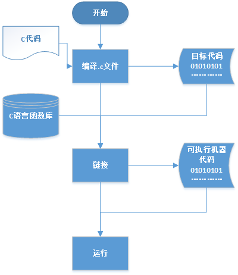
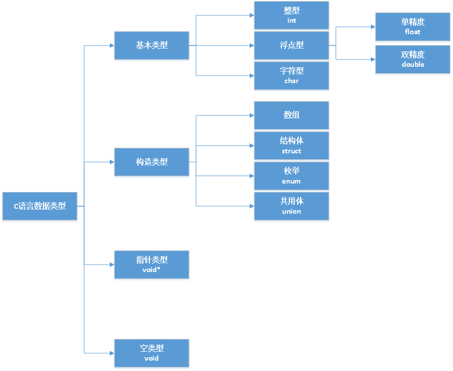
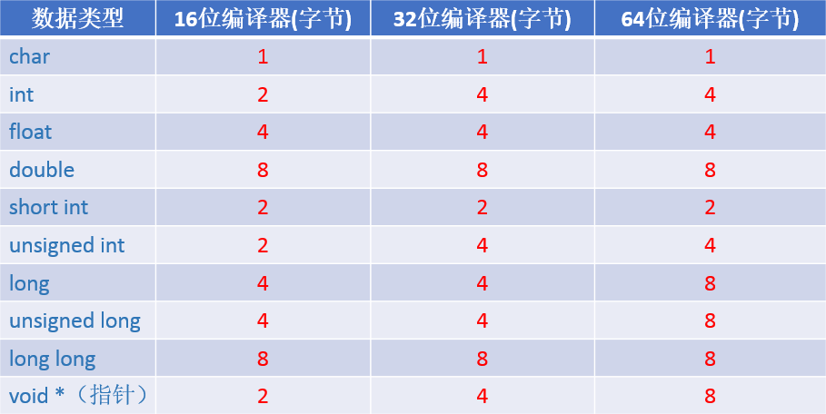
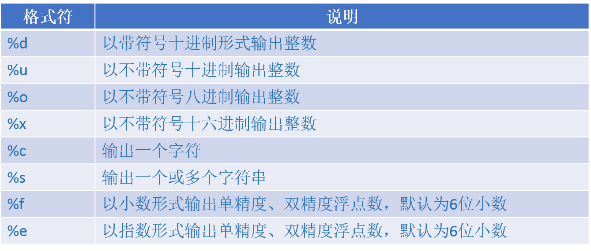
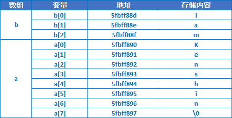

[TOC]
# OC语法
## 基础知识

### main

1. main函数是程序入口，一个程序只能有一个main()函数，需要有一个整型返回值（事实上返回值int可以省略，但是这并不代表不返回值，而是默认为int；我们也可以在main()函数中不提供return，这是因为c语言语法要求不够严格）。
* main函数总是返回0，0代表成功终止程序，1代表错误终止。
也可以理解为：
	* 0（false）：无错误返回
	* 1（true）：有错误返回

2. \#include是预处理指令，用于包含指定文件（注意在编译前即处理），它实际做的工作就是把对应文件复制到指定的位置； 包含的内容可以是任何类型的文件，而不仅仅是.h文件；
> \#include 包含文件时有两种方式：使用<>和””。区别就是<>包含只会查找编译器库函数文件，因此适用于包含库函数；而“”包含则首先查找程序当前目录，如果没有找到则查找库函数路径，因此适用于自定义文件；
```c
#include <stdio.h>

void showMessage(){
    printf("Hello, World!\n");
}

int main(int argc, const char * argv[]) {
    // insert code here...
    showMessage()
    return 0;
}
```
> 上面的showMessage函数必须写在main()函数上面，如果写在下面则必须在main()函数之前声明；

### 运行过程


C语言的运行分为两大步：编译和链接

* 编译：编译阶段会将对应的xxx.c源文件（ASCII格式）编译成目标文件xxx.obj，它是二进制格式（当然一般我们会有多个.c文件，也就会生成多个对应的.obj）；在编译之前要进行预处理（例如#include指令），在编译的同时还要进行语法检查；生成的.obj文件并不能单独执行，因为各个.obj之间是有关联的，而且他们还各自引用了C语言库函数；

* 链接：链接的过程就是将各个.obj文件和C语言库函数一起组合生成一个可执行文件的过程；

#### 扩展

我们通常将一个子操作分为两个文件：.c文件和.h文件。在.c文件中实现对应的函数，在.h中进行函数声明，这样只要在主函数上方包含对应的头文件就可以将子操作分离出来而且不用考虑顺序问题。如下所示：

message.h

```c
#ifndef message_h
#define message_h

#include <stdio.h>

void showMessage();

#endif /* message_h */
```

message.c

```c
#include "message.h"

void showMessage(){
    printf("Hello world!\n");
}
```

> 注意：message对应的.c和.h文件名完全可以不相同，但是出于规范的目的我们还是取相同的文件名

> **思考：如果我们不分成两个文件，直接在主函数文件中包含message.c是否也可以正常运行呢？答案是否定的。**
>
> **原因是main.c中\#Include指令会把message.c复制到main.c中。编译后的main.obj已包含showMessage函数。因此在main.obj和 message.obj在链接时会发现main.obj中已经有message.obj中定义的showMessage函数，抛出“标示符重复”的错误。**

### 数据类型



#### 类型修饰符（限定符）

从上图我们可以清晰的看到C语言的数据类型结构，对于基本类型我们还有一些类型修饰符

* short 短型 ：修饰int、double

* long 长型：修饰int、double

* signed 有符号型,修饰int、char

* unsigned 无符号型，修饰int、char

> 1. 这些修饰符经常用来修饰int型，**在修饰int类型时int可以省略**；
> 2. short和long会改变int型的长度，不同编译器项长度不相同，但是short长度不大于int，int长度不大于long；
> 3. signed、unsigned不改变类型长度，仅仅表示最高位是否为符号位，unsigned表示大于等于0的正数；




> **注意：**
>
> **1. char类型是最小的数据类型单位，在任何类型的编译器下都是占用1个字节，char类型的变量赋值可以直接赋值等于某个字符也可以赋值为整数（对应的ASCII值）;**
>
> **2. 可以使用两个long来修饰一个整形（就是经常使用的8字节的整形long long），但是两个long不能修饰double而且也不存在两个short，否则编译警告;**
>
> **3. 一个浮点型常量如果后面加上f编译器认为它是float类型，否则认为double类型，例如10.0是double类型，10.0f是float类型。**
```c
unsigned x; //无符号32位整数
signed y; //有符号16位整数
char a;  //8位
short b; //通常是16位（视平台而定）
int c;   //通常是32位（视平台而定）
long d;  //32位或64位（视平台而定）
long long e; //64位
```

### 运算符

C语言中有34中运算符，同C#、Java等语言没有太大的区别，这里指列出一些注意事项：

1. 关系运算符为真就返回1，为假就返回0；在条件语言中非0即真（负数、正数均为真），只有0为假 ；

2. C语言可以不保存关系运算符的值 ；

3. 逗号表达式最终的值是最后一个表达式的值；

例子：
```c
#include <stdio.h>


int main(int argc, const char * argv[]) {
    int a=2>1,b=2<1,c=99,d=0;
    int f=0,g=0,h=0,e=(f=3,g=4,h=5);
    
    a>0;//没有保存运算结果
    
    printf("%d,%d\n",a,b);//结果：1,0
    
    if(c){//可以通过
        printf("true.\n");
    }
    if(d){//无法通过
        printf("false\n");
    }
    
    printf("%d\n",e);//结果：5
    return 0;
}
```

### 常用函数

#### printf()函数

printf()函数用于向标准输出设备输出数据，配合格式符可以完成强大的输出功能。



```c
#include <stdio.h>


int main(int argc, const char * argv[]) {
    int a=16;
    float b=79.3f;
    printf("[a=%4d]\n",a);
    printf("[a=%-4d]\n",a);
    printf("[b=%10f]\n",b);
    printf("[b=%.2f]\n",b);
    printf("[b=%4.2f]\n",b);
    return 0;
}
```

结果如下：

```c
[a=  16]
[a=16  ]
[b= 79.300003]
[b=79.30]
[b=79.30]
Program ended with exit code: 0
```

#### scanf()函数

1. 参数接收以回车进行结束操作；
2. 如果需要接收多个参数，多个参数之间的分隔符是任意的，但是如果分隔符是“空格”则实际输入的时候分隔符可以使空格、tab和回车（最后一个回车认为是结束符）

```c
#include <stdio.h>


int main(int argc, const char * argv[]) {
    int a,b,c;
    scanf("%d,%d,%d",&a,&b,&c);//此时需要输入：1,2,3 然后回车
    printf("a=%d,b=%d,c=%d\n",a,b,c);
    return 0;
}

```


## 数组

### 一维数组

1. 一维数组长度必须是固定的，长度不能使用变量进行初始化；如果声明的同时进行赋值则数组长度可以省略，编译器会自动计算数组长度；同时数组不能先声明再一次性赋值。

```c
#include <stdio.h>

int main(){
    int len = 2;
    //int a[len] = { 1, 2};//错误,不能使变量
    int a[2];//正确
    a[0] = 1;
    a[1] = 2;
    //a[2] = 3;//超过数组长度，但是编译器并不会检查，运行报错
    int b['a'] = {1,2,3};//因为'a'的ASCII为97，所以可以作为数组长度，但是后面的元素没有初始化，其值默认为0
    for (int i = 0; i < 97; ++i){
        printf("b[%d]=%d\n",i,b[i]);
    }
    int c[2 * 3];//2*3是固定值可以作为数组长度
    int d[] = { 1, 2, 3 };//如果初始化的同时赋值则数组长度可以省略，当前个数为3
}
```

2. 数组在内存中存储在一块连续的空间中，如果知道数组类型（int、float等）和初始地址就可以知道其他元素的地址，同时由于数组名等于数组第一个元素的地址，所以当数组作为参数（作为参数时形参可以省略）其实是引用传递。

```c
#include <stdio.h>

int main(){
    int const l = 3;
    int a[l] = { 1, 2,3 };
    for (int i = 0; i < l; ++i){
        //由于当前在32位编译器下，int型长度为4个字节，可以判断出三个地址两两相差都是4
        printf("a[%d]=%d,address=%x\n", i, a[i], &a[i]);
    }
    /*当前输出结果：
    a[0] = 1, address = c9f95c
    a[1] = 2, address = c9f960
    a[2] = 3, address = c9f964*/
}
```

数组作为参数传递的情况，数组作为参数传递的是数组的地址：

```c
#include <stdio.h>

void changeValue(int a[]){ 
    a[0] = 10; //a[0]元素的地址指向了10，因此下面打印的a的值是a[0]=10，a[1]=2
}

int main(){ 
    int a[2] = {1,2};
    changeValue(a); 
    for (int i = 0; i < 2; ++i){
        printf("a[%d]=%d\n",i,a[i]);
    } 
    /*打印结果
    a[0]=10
    a[1]=2
    */
}
```

### 多维数组

多维数组的数组名就是整个二维数组的地址，也等于第一行数组名的地址，还等于第一个元素的地址；第二行数组名等于第二行第一个元素的地址。用表达式表示：

1. a=a[0]=&a\[0][0]
2. a[1]=&a\[1][0]

同样可以得出a\[i][j]=a[i]+j。关于三维数组、四维数组等多维数组，其实可以以此类推。

看实例：

```c
#include <stdio.h>

int main(){
    int a[2][3];//2行3列，二维数组可以看成是一个特殊的一维数组，只是它的每一个元素又是一个一维数组
    a[0][0] = 1;
    a[0][1] = 2;
    a[0][2] = 3;
    a[1][0] = 4;
    a[1][1] = 5;
    a[1][2] = 6;
    for (int i = 0; i < 2; ++i){
        for (int j = 0; j < 3; ++j){
            printf("a[%d][%d]=%d,address=%x\n", i, j, a[i][j], &a[i][j]);
        }
    }
    /*打印结果
    a[0][0]=1,address=f8fb24
    a[0][1]=2,address=f8fb28
    a[0][2]=3,address=f8fb2c
    a[1][0]=4,address=f8fb30
    a[1][1]=5,address=f8fb34
    a[1][2]=6,address=f8fb38
    */
    //初始化并直接赋值
    int b[2][3] = { { 1, 2, 3 }, { 4, 5, 6 } };
    //由于数组的赋值顺序是先从第一行第一列，再第一行第二列...然后第二行第一列...，所以我们也可以写成如下形式
    int c[2][3] = { 1, 2, 3, 4, 5, 6 };
    //也可以只初始化部分数据，其余元素默认为0
    int d[2][3] = { 1, 2, 3, 4 };
    for (int i = 0; i < 2; ++i){
        for (int j = 0; j < 3; ++j){
            printf("d[%d][%d]=%d\n", i, j, d[i][j]);
        }
    }
    /*打印结果
    d[0][0]=1
    d[0][1]=2
    d[0][2]=3
    d[1][0]=4
    d[1][1]=0
    d[1][2]=0
    */
    //当然下面赋值也可以
    int e[2][3] = { {}, { 4, 5, 6 } };
    //可以省略行号,但是绝对不可以省略列号，因为按照上面说的赋值顺序，它无法判断有多少行
    int f[][3] = { {1,2,3},{4,5,6} };
}
```

## 字符串

### 概念

在C语言中是没有字符串类型的，如果要表示字符串需要使用char类型的数组，因为字符串本身就是多个字符的组合。但是需要注意的是字符串是一个特殊的数组，在它的结束位置必须要加一个”\0”（ASCII中0是空操作符，表示什么也不做）来表示字符串结束，否则编译器是不知道什么时候字符串已经结束的。当直接使用字符串赋值的时候程序会自动加上”\0”作为结束符。

```c
#include <stdio.h>

int main(int argc, const char * argv[])
{

    char a[] = {'K','e','n','s','h','i','n','\0'};
    printf("%s",a); //结果：Kenshin，注意使用%s输出字符串内容，如果换成整形输出格式其实输出的是a的地址
    printf("\n");
    printf("address=%x", a); //结果：address=5fbff890
    printf("\n");
    //后面的\0绝对不能省略,如果没有\0则会出现如下情况
    char b[] = { 'I', 'a', 'm'};
    printf("%s",b); //没有按照期望输出，多了一些垃圾数据，在当前环境打印结果：IamKenshin
    printf("\n");
    printf("address=%x",b); //结果：address=5fbff88d
    printf("\n");
    //直接赋值为字符串，此时不需要手动添加\0，编译器会自动添加
    char c[] = "Kenshin";
    printf("c=%s",c); //结果：c=Kenshin
    printf("\n");
    
    //二维数组存储多个字符串
    char d[2][3]={"Kenshin","Kaoru","Rose","Jack","Tom","Jerry"};
    
    
    return 0;
}
```




从图中我们不难发现由于a占用8个字节，而定义完a后直接定义了b，此时分配的空间连续，b占用3个字节，这样当输出b的时候由于输出完“Iam”之后并未遇到”\0”标记，程序继续输出直到遇到数组a中的“\0”才结束，因此输出内容为“IamKenshin”。

### 字符串操作常用函数

```c
#include <stdio.h>

int main(int argc, const char * argv[])
{
    /*字符操作*/
    putchar('a'); //结果：a，putchar一次只能输出一个字符
    printf("\n");
    putchar(97);//结果:a
    printf("\n");
    char a;
    a=getchar();//getchar()一次只能接收一个字符，可以接收空格、tab、回车
    printf("a=%c",a);
    printf("\n");

    /*字符串操作*/
    char b[]="Kenshin";
    printf("b=%s",b);
    printf("\n");
    puts(b); //puts用于输出单个字符串，不能像printf格式化输出，会自动添加换行
    printf("\n");
    
    char c[10];
    scanf("%s",c);//注意c没必要写成&c，因为c本身就代表了数组的地址
    printf("c=%s\n",c);//注意即使你输入的内容大于10，也能正确输出，但是下面的gets()函数却不行
    printf("\n");
    
    //gets()函数，注意它是不安全的，因为接收的时候不知道它的大小容易造成溢出，建议不要使用
    char d[10];
    gets(d); //gets一次只能接收一个字符串，但是scanf可接收多个；scanf不能接收空格、tab，gets则可以
    printf("d=%s",d);
    printf("\n");
    
    char e[]={'K','s','\0'};
    printf("%lu",strlen(e)); //结果是：2，不是3，因为\0不计入长度
    printf("\n");
    char f[]={"Kenshin"};
    printf("%lu",strlen(f)); //结果是：7
    printf("\n");
    
    char g[5];
    strcpy(g,"hello,world!");
    printf("%s",g); //结果是：hello,即使定义的g长度为5，但是也能完全拷贝进去
    printf("\n");
    char h[5];
    char i[]={'a','b','c','\0','d','e','f','\0'};
    strcpy(h,i);
    printf("%s",h); //结果是：abc,遇到第一个\0则结束
    printf("\n");
    
    strcat(i,"ghi");
    printf("%s",i); //结果是：abcghi,注意不是abcdefghi,strcat，从i第一\0开始使用“ghi”覆盖，覆盖完之后加上一个\0,在内存中目前应该是：{'a','b','c','g','h','i','\0','f','\0'}
    printf("\n");
    
    char j[]="abc";
    char k[]="aBc";
    char l[]="acb";
    char m[]={'a','\0'};
    printf("%d,%d,%d",strcmp(j,k),strcmp(k,l),strcmp(l,m));//遇到第一个不相同的字符或\0则返回两者前后之差，结果：32,-33,99
    printf("\n");

    return 0;
}
```

> 注意:
>
> 1. 在Xcode中会提示gets是不安全的，推荐使用fgets()。
>
> 2. strlen()只用于计算字符串长度，由于在C语言中字符串使用字符数组长度表示，所以它可以计算带有’\0’结尾的字符数组长度，但是它并不能计算其他类型的数组长度。

## <u>*指针*</u>

### 概念

​	存放变量地址的变量我们称之为“指针变量”,简单的说变量p中存储的是变量a的地址,那么p就可以称为是指针变量,或者说p指向a。当我们访问a变量的时候其实是程序先根据a取得a对应的地址，再到这个地址对应的存储空间中拿到a的值，这种方式我们称之为“直接引用”；而当我们通过p取得a的时候首先要先根据p转换成p对应的存储地址，再根据这个地址到其对应的存储空间中拿到存储内容，它的内容其实就是a的地址，然后根据这个地址到对应的存储空间中取得对应的内容，这个内容就是a的值，这种通过p找到a对应地址再取值的方式成为“间接引用”。

实例：

```c
#include <stdio.h>

int main(int argc, const char * argv[]) {
    //实例一
    int a=1;
    int *p;
    p=&a; //也可以直接给指针变量赋值：int *p=&a;
    printf("address(a)=%x,address(p)=%x\n",&a,p); //结果：address(a)=5fbff81c,address(p)=5fbff81c
    printf("a=%d,p=%d\n",a,*p); //结果：a=1,p=1
    *p=2;
    printf("a=%d,*p=%d\n",a,*p); //结果：a=2,p=2
    
    //实例二
    int b=8;
    char c= 1;
    int *q=&c;
    printf("address(b)=%x,address(c)=%x\n",&b,&c);//结果：
    printf("c=%d,q=%d\n", c, *q); //结果：c=1,q=2049，为什么q的值不是1呢？
    
    return 0;
}
```

> * int *p;中的*只是表示p变量是一个指针变量；而打印*p的时候，*p中的*是操作符，表示p指针指向的变量的存储空间（当前存储就是1），同时我们也看到了*p==a；修改了*p也就是修改了p指向的存储空间的内容，也就修改了a，所以第二次打印a=2;
>
> * 指针所指向的类型必须和定义指针时声明的类型相同；上面指针q定义成了int型而指向了char型，结果输出*q打印出了2049，具体原因见下图（假设在16位编译器下，指针长度为2字节）


1. 首先，上面例子中全部是局部变量，局部变量保存在栈中，因此保存的顺序是b，c，p

2. 其次，\*q表示p指针指向的变量的存储空间，也就是c的存储空间。而\*q是int型（假设在16位的编译器下），指针长度为2字节，因此*q的值为b、c存储空间的值，即000100000000001，十进制为2049

### 数组和指针

```c
#include <stdio.h>

void changeValue(int a[]){
    a[0]=2;
}
void changeValue2(int *p){
    p[0]=3;
}

int main(int argc, const char * argv[]) {
    int a[]={1,2,3};
    
    //数组名就是数组的地址，也就是第一个元素的地址
    int *p=&a[0]; //等价于：*p=a;
    
    printf("len=%lu\n",sizeof(int));//取得int长度为2
    
    //指针加1代表地址向后挪动所指向类型的长度位（这里类型是int，长度为2）
    //也就是说p指向a[0],p+1指向a[1]，以此类推，所以我们通过指针也可以取出数组元素
    for(int i=0;i<3;++i){
        //printf("a[%d]=%d\n",i,a[i]);
        printf("a[%d]=%d\n",i,*(p+i));//由于a就代表数组的地址，其实这里还可以写成*(a+i),但是注意这里*(p+i)可以写成*(p++),但是*(a+i)不能写成*(a++),因为数组名是常量
    }
    /*输出结果：
     a[0]=1
     a[1]=2
     a[2]=3
     */
     
    
    changeValue(p); //等价于：changeValue(a)
    for(int i=0;i<3;++i){
        printf("a[%d]=%d\n",i,a[i]);
    }
    /*输出结果：
     a[0]=2
     a[1]=2
     a[2]=3
     */
    
    changeValue2(a); //等价于：changeValue2(p)
    for(int i=0;i<3;++i){
        printf("a[%d]=%d\n",i,a[i]);
    }
    /*输出结果：
     a[0]=3
     a[1]=2
     a[2]=3
     */
    
    return 0;
}
```

1. \*p等价于数组名（数组名就是数组的地址），等价于a[0]地址，即：\*p==数组名a==&a[0]；

2. 如果p指向一个数组，那么p+1指向数组的下一个元素，同时注意p+1移动的长度并不固定，具体需要根据p指向的数据类型而定；

3. 指针可以写成p++形式，但是数组名不可以，因为数组名是常量

4. 不管函数的形参为数组还是指针，实参都可以使用数组名或指针（因为实际上传的都是地址）；

### 字符串和指针

```c
#include <stdio.h>

int main(int argc, const char * argv[]) {
    char a[]="Kenshin";
    printf("%x,%s\n",a,a);//结果：5fbff820,Kenshin，同一个变量a是输出字符串还是输出地址，根据格式参数而定
    printf(a); //结果：Kenshin
    printf("\n");
    
    char b[]="Kenshin";
    char *p=b;
    printf("b=%s,p=%s\n",b,p);//结果：b=Kenshin,p=Kenshin
    
    //指针存储的是地址，而数组名存储的也是地址，既然字符数组可以表示字符串，那么指向字符的指针同样也可以，如下方式可以更简单的定义一个字符串
    char *c="Kenshin"; //等价于char c[]="Kenshin";
    printf("c=%s\n",c); //结果：c=Kenshin
    
    return 0;
}
```

### 函数指针

1. 例子一，返回指针类型函数：

   ```c
   #include <stdio.h>
   
   char * toUpper(char *a){
       char *b=a; //保留最初地址，因为后面的循环会改变字符串最初地址
       int len='a'-'A'; //大小写ASCII码差值相等
       while (*a!='\0') { //字符是否结束
           if(*a>'a'&&*a<'z'){//如果是小写字符
               *(a++) -= len; //*a表示数组对应的字符（-32变为小写），a++代表移动到下一个字符
           }
       }
          return b;
   }
   
   int main(int argc, const char * argv[]) {
       char a[]="hello";
       char *p=toUpper(a);
       printf("%s\n",p); //结果：HELLO
       return 0;
   }
   ```
   > **指针作为型参时，传递的是参数的地址。**

2. 例子二：函数返回多个值

   ```c
   #include <stdio.h>
   
   int operate(int a,int b,int *c){
       *c=a-b;
       return a+b;
   }
   
   int main(int argc, const char * argv[]) {
       int a=1,b=2,c,d;
       d=operate(a, b, &c);
       printf("a+b=%d,a-b=%d\n",d,c);//结果：a+b=3,a-b=-1
       return 0;
   }
   ```

   > **如果需要函数返回多个值，，只要将指针作为函数参数传递就可**

3. 例子三：函数指针的关系

   ```c
   #include <stdio.h>
   
   int sum(int a,int b){
       return a+b;
   }
   
   int sub(int a,int b){
       return a-b;
   }
   
   //函数指针作为参数进行传递
   int operate(int a,int b,int (*p)(int,int)){
       return p(a,b);
   }
   
   int main(int argc, const char * argv[]) {
       int a=1,b=2;
       int (*p)(int ,int)=sum;//函数名就是函数首地址,等价于：int (*p)(int,int);p=sum;
       int c=p(a,b);
       printf("a+b=%d\n",c); //结果：a+b=3
       
       
       //函数作为参数传递
       printf("%d\n",operate(a, b, sum)); //结果：3
       printf("%d\n",operate(a, b, sub)); //结果：-1
       
       return 0;
   }
   ```

   > * 函数指针定义的形式：**返回值类型 (*指针变量名)(形参1，形参2)**，拿到函数指针其实我们就相当于拿到了这个函数，函数的操作都可以通过指针来完成，而且通过前面的例子可以看到指针作为C语言的数据类型，可以作为参数、作为返回值，那么当然函数指针同样可以作为函数的参数和返回值。
   >
   > * 普通的指针可以写成p++进行移动，而函数指针写成p++并没有意义。

## C语言预处理

### 概述

一个C程序的运行包括**编译**和**链接**两个阶段，其实**在编译之前预处理器首先要进行预处理操作**，将处理完产生的一个新的源文件进行编译。由于预处理指令是在编译之前就进行了，因此很多时候它要比在程序运行时进行操作效率高。在C语言中包括三类预处理指令：
1. 宏定义
2. 条件编译
3. 文件包含

### 宏定义

对于程序中经常用到的一些常量或者简短的函数我们通常使用宏定义来处理，这样做的好处是对于程序中所有的配置我们可以统一在宏定义中进行管理，而且由于宏定义是在程序编译之前进行替换相比定义成全局变量或函数效率更高。

1. 语法

   ```c
   #include <stdio.h>
   #define PI 3.14 //宏定义一般大写
   #define R 10
   #define S 2*PI*R //在另一个宏里面引用了上面的宏
   
   int main(int argc, const char * argv[]) {
       float r=10.5;
       double area=PI*r*r;
       printf("area=%.2f\n",area);
       
       double a=S;
       printf("a=%.2f\n",a);
       printf("PI=3.14\n");//注意输出结果不是3.14=3.14而是PI=3.14，字符串中的PI并不会被替换
   #undef PI //强制终止宏定义，否则它的范围一直到文件结束
       int PI=3.1415926;
       double area2=PI*r*r;
       printf("area2=%.2f\n",area2);
       
       return 0;
   }
   ```

   > * 通过**#define  宏名  返回值** 指令定义宏，宏定义一般用大写
   > * 宏定义式可以引用其他宏
   > * 通过**#undef  宏名**指令终止宏定义

2. 宏定义传参

   ```c
   #include <stdio.h>
   #define SUM(a,b) a+b
   #define SUB(a,b) (a-b)
   #define MUL (a,b) (a*b) //这么定义是错误的，预处理器会认为宏名为”MUL“,替换内容为”(a,b) (a*b)“
   
   
   int main(int argc, const char * argv[]) {
       
       int a=2,b=3,c,d;
       c=SUM(a, b);
       printf("c=%d\n",c); //结果：c=5
       d=SUM(a, b)*2;
       printf("d=%d\n"); //结果：8,为什么不是10呢？因为替换后：d=a+b*2也就是2+3*2=8
       
       int e=SUB(b, a)*2;
       printf("(b-a)*2=%d\n",e); //结果：2,如果SUB定义时不加括号这里应该是-1
       
       return 0;
   }
   ```

   > 注意：宏功能很强大，有点类似于函数，同函数不同的是它只是简单的替换，不涉及存储空间分配，参数、返回值等问题，但是由于它在预处理阶段展开，所以一般效率较高。**使用带参数的宏需要注意的就是结果最好用括号括起来否则很容易出现问题（在上面的SUM例子中我们应该已经看到了）；还有一点就是带参数的宏定义时名称和参数之间不要有空格**

### 条件编译

条件编译其实就是在编译之前预处理器根据预处理指令判断对应的条件，如果条件满足就将对应的代码编译进去，否则代码就根本不进入编译环节（相当于根本就没有这段代码）。

```c
#include <stdio.h>
#define COUNT 1

int main(int argc, const char * argv[]) {
    
//判断是否定义了 COUNT 宏
#if defined(COUNT) //等价于：#ifdef COUNT,相反如果判断没有定义过则可以通过#if !defined(COUNT)或者#ifndef COUNT
    printf("COUNT defined\n");
#endif
    
//判断宏定义COUNT是否等于1
#if COUNT==1
    showMessage("hello,world!\n");
#else
    say();
#endif
    
    return 0;
}
```

### 文件包含

再次强调：

1. 首先使用#include “xxx”包含和使用#include <xxx>包含的不同之处就是使用<>包含时，预处理器会搜索C函数库头文件路径下的文件，而使用“”包含时首先搜索程序所在目录，其次搜索系统Path定义目录，如果还是找不到才会搜索C函数库头文件所在目录。

2. 另外在使用#include的时候我们需要注意包含文件的时候是不能递归包含的，例如a.h文件包含b.h，而b.h就不能再包含a.h了；还有就是重复包含虽然是允许的（这里指的是重复包含头文件）但是这会降低编译性能。

## <u>*存储方式和作用域*</u>

### 变量的作用域

1. 全局变量：全局变量在定义之后所有的函数中均可以使用，只要前面的代码修改了，那么后面的代码中再使用就是修改后的值；
2. 局部变量：局部变量的作用范围一般在一个函数内部（通常在一对大括号{}内），外面的程序无法访问它，它却可以访问外面的变量；

```c
#include <stdio.h>

int a=1;
void changeValue(){
    a=2;
    printf("a=%d\n",a);
}
int main(int argc, const char * argv[]) {
    int b=1;
    changeValue(); //结果：a=2
    printf("a=%d,b=%d\n",a,b); //结果：a=2,b=1 ，因为changeValue修改了这个全局变量
    return 0;
}
```

### <u>*变量的存储方式*</u>

C语言的强大之处在于它能直接操作内存（指针），但是要完全熟悉它的操作方式我们必须要弄清它的存储方式。存储变量的位置分为：**普通内存(静态存储区)、运行时堆栈（动态存储区）、硬件寄存器（动态存储区），当然这几种存储的效率是从低到高的**。而根据存储位置的不同在C语言中又可以将变量依次分为：**静态变量、自动变量、寄存器变量**。

#### 静态变量

存储在普通内存中的静态变量，全局变量和使用static声明的局部变量都是静态变量，在系统运行过程中只初始化一次。

```c
#include <stdio.h>

int a=1; //全局变量存储在静态内存中，只初始化一次

void showMessage(){
    static int b=1; //静态变量存储在静态内存中，第二次调用不会再进行初始化
    int c=1;
    ++b;
    a+=2;
    printf("a=%d,b=%d,c=%d\n",a,b,c);
}

int main(int argc, const char * argv[]) {
    showMessage(); //结果：a=3,b=2,c=1
    showMessage(); //结果：a=5,b=3,c=1
    return 0;
}
```

#### 自动变量

被关键字auto修饰的局部变量是自动变量，但是auto关键字可以省略，因此可以得出结论：所有没有被static修饰的局部变量都是自动变量。

存储自动变量的栈和堆其实是两个完全不同的空间（虽然都在运行时有效的空间内）：

- 栈一般是程序自动分配，其存储结果类似于数据结构中的栈，先进后出，程序结束时由编译器自动释放
- 堆则是开发人员手动编码分配，如果不进行手动释放就只有等到程序运行完操作系统回收，其存储结构类似于链表。在下面的代码中p变量同样是一个自动变量，同样可以使用auto修饰，只是它所指向的内容放在堆上（p本身存放在栈上）。

```c
#include <stdio.h>
#include <stdlib.h>

int main(int argc, const char * argv[]) {
    int a=1;
    auto int b=2;
    printf("a=%d,b=%d\n",a,b); //结果：a=1,b=2 ，a和b都是自动变量，auto可以省略
    
    //需要注意的是，上面的自动变量是存储在栈中，其实还可以存储到堆中
    char c[]="hello,world!";
    long len=strlen(c)*sizeof(char)+1;//之所以加1是因为字符串后面默认有一个\0空操作符不计算在长度内
    char *p=NULL;//可以直接写成：char *p;
    p=(char *)malloc(len);//分配指定的字节存放c中字符串，注意由于malloc默认返回“void *”需要转化
    memset(p,0,len);//清空指向内存中的存储内容，因为分配的内存是随机的，如果不清空可能会因为垃圾数据产生不必要的麻烦
    strcpy(p,c);
    printf("p=%s\n",p);//结果：p=hello,world!
    free(p);//释放分配的空间
    p=NULL;//注意让p指向空，否则p将会是一个存储一个无用地址的野指针
    
    
    return 0;
}
```

> 注意：malloc分配的空间在逻辑上连续，物理上未必连续；p必须手动释放，否则直到程序运行结束它占用的内存将一直被占用；释放p的过程只是把p指向的空间释放掉，p中存放的地址并未释放，需要手动设置为NULL，否则这将是一个无用的野指针；

#### 寄存器变量

1. 默认情况下无论是自动变量还是静态变量它们都在内存中，不同之处就是自动变量放在一块运行时分配的特殊内存中。但是**寄存器变量却是在硬件寄存器中，从物理上来说它和内存处在两个完全不同的硬件中**。大家都是知道寄存器存储空间很小，但是它的效率很高，那么合理使用寄存器变量就相当重要了。什么是寄存器变量呢？使用register修饰的int或char类型的非静态局部变量是寄存器变量。没错，需要三个条件支撑：**register修饰、必须是int或char类型、必须是非静态局部变量**。

2. 除了存储位置不同外，寄存器变量完全符合自动变量的条件，因此它的生命周期其实是和自动变量完全一样的，当函数运行结束后它就会被自动释放。由于寄存器空间珍贵，因此我们需要合理使用寄存器变量，只有访问度很高的变量我们才考虑使用寄存器变量，如果过多的定义寄存器变量，当寄存器空间不够用时会自动转化为自动变量。

```c
#include <stdio.h>

int main(int argc, const char * argv[]) {
    register int a=1;
    printf("a=%d\n",a);
    return 0;
}
```

> C语言中还有两种存储类型：常量存储区和代码存储区，分别用于存储字符串常量、使用const修饰的全局变量以及二进制函数代码。

### 可访问性

在C语言中没有其他高级语言public、private等修饰符，来限定变量和函数的有效范围，但是却有两个类似的关键字能达到类似的效果：extern和static。

#### extern

1. extern作用于变量


### 格式化字符串

* %d：十进制整数
* %s：字符串（char，NSString是对象）
* %o：八进制（octol）
* %x：十六进制（hexadecimal）
* %u：无符号十进制整数
* %f：浮点数
* %e：浮点数科学计数法
* %p：内存地址格式说明，一般内存地址都已十六进制输出
* %zu：数据类型大小
* %@：输出对象的描述信息
* 

> 1. 在%和转换字符间加入==l（long）或者ll（long long）==，指明是大整数数据类型，如：%ld、%lo、%lx
> 2. 通过在%和f或者e之间加入小数点和数字来指定浮点数小数位数，如：%.2f（两位小数）, %.2e（两位小数科学计数法）


### 变量
1. NSInteger（有符号）、NSUInteger（无符号）可以在32位和64位系统中通用的数字类型。printf这两种类型时，需要转换为long型，如：
```c
    NSInteger x = -5;
    NSUInteger y = 6;
    printf("Here they are: %ld, %lu", (long)x, (unsigned long)y)
```

### 方法
1. abs(), labs()：前者计算int型绝对值、后者计算long型绝对值，需要include <stdlib.h>
2. include <math.h>使用数学代码库。
3. readline()：获取用户输入，需要引入代码库；libreadline.tbd
4. atoi()：将字符串转为整数，如：
```c
int num = "23" //出错

int num = atoi("23") //正确

int num = atoi("abc") //记过为0
```
> 如果字符串无法转为int，则返回0

5. sizeof()：得到某个数据类型的大小，结合指针地址使用可以获取数据在内存中的结束地址。
    * sizeof()会返回一个类型为size_t的数，与之对应的格式说明符为%zu
    * sizeof()传入的参数还可以是变量
```c
int i = 7;
int *addressOfI = &i
printf("An int is %zu\n", sizeof(int)); //结果为：AN int is 4

printf("A pointer is %zu\n", sizeof(int *));//结果为：A pointer is 8

printf("A pointer is %zu\n", sizeof(addressOfI));//结果为：A pointer is 8
```

6. modf()：调用该方法时传入double类型的数与指针地址，会返回小数部分，并且将整数部分保存到指针地址中。
    * 需要include <math.h>
    * 这种参数传递方式称为==通过引用传递==


### 指针
> 可以通过变量存储指针地址，通过指针地址变量可以快速传递大数据所在内存地址

1. 在变量前面添加&运算符，来获得变量的内存地址
2. 有三种用途：
    * 声明指针，使变量指向内存地址；
    * 访问保存在内存地址中的数据；
    * 用在赋值表达式的左侧，将数据保存在指定的地址；
```c
int i = 7;
int *addressOfI = &i; //声明指针，使变量指向内存地址
printf("i stores its value at %p\n", &addressOfI);
//输出结果为：i stores its value at 0x7fff5fbff65c

printf("the int stored at addressofi is %d\n", *addressOfI); //访问保存在内存地址中的数据
//输出结果为：the int stored at addressofi is 7

*addressOfI = 88; //用于赋值表达式左侧，将88保存到指定的内存地址，因为变量i也指向相同地址，所以i的值为：88
printf("Now i is %d\n", i);
//输出结果为：Now i is 88
```
3. NULL
    * objective-c中nil等价于NULL，均表示空指针；
    * NULL就是0

> 某些情况需要使用“空”指针，不指向任何地址。换句话说，有一个指针变量，要给这个变量附上一个值，用来说明此变量没指向任何地址。NULL就是这样一个值，用来说明这个指针变量未指向任何地址。

### 结构（structure）
1. 使用结构（struct），来定义多个数据的组合体，类似Java中的pojo
2. 定义结构的两种方式
  * sturct关键字，定义的时候都要写struct关键字
  * typedef关键字
```c
/// 1.sturct关键字，定义的时候都要写struct关键字
struct Person {
    float height;
    int weight;
}

int main(int argc, const char * argv[]){
    struct Person leron; //声明Person变量时需要struct关键字
    leron.height = 1.80;
    leron.weight = 75;
}

/// 2.typedef关键字
typedef struct {
    float height;
    int weight;
}Person；

int main(int argc, const char * argv[]){
    Person leron; //声明Person变量时不需要struct关键字
    leron.height = 1.80;
    leron.weight = 75;
}
```

### 栈 & 堆
1. 栈：调用函数时系统自动分配，并在函数结束时自动释放。
2. 堆：特定内存区域，与栈是分开的。通常连续内存区域叫做：缓冲区。缓冲区来自堆，独立于任何函数的栈，因此可以在多个函数中使用。
> 在C中可以通过malloc()函数得到一块内存缓冲区。当程序不再使用缓冲区时，可以使用free()函数释放内存，还给堆

```c
#include <stdio.h>
#include <stdlib.h>

void get1000floatBuffer(){
    float *startOfBuffer; //声明缓冲区指针变量
    
    startOfBuffer = malloc(1000 * sizeof(float));//获取可以存放1000个float类型变量的内存大小的缓冲区
    
    //。。。使用缓冲区。。。
    
    free(startOfBuffer);//释放缓冲区
    
    startOfBuffer = NULL;//将指针变量赋值为NULL
}

typedef struct {
    float height;
    int weight;
}Person;

float bodyMassIndex(Person *p){
    return p->weight / (p->height * p->height);
}

int main(int argc, const char * argv[]) {
    // insert code here...
    //get1000floatBuffer();
    
    //为Person分配缓冲区
    Person *leron = (Person *)malloc(sizeof(Person));
    printf("leron buffer address: %p\n", &leron);
    
    //为数据结构赋值
    //->函数作用：先获取指针leron指向的数据结构，然后返回该结构的成员变量
    leron->height = 1.8;
    leron->weight = 75;
    
    float leronBMI = bodyMassIndex(leron);
    printf("leron has a BMI of %f\n", leronBMI);
    
    free(leron);
    
    leron = NULL;
    
    return 0;
}
```