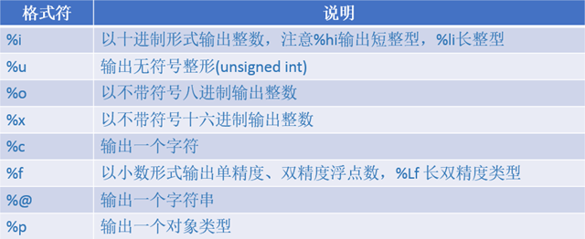

# Object-C

## 基础概览

### Hello World

```objc
#import <Foundation/Foundation.h>

int main(int argc, const char * argv[]) {
    @autoreleasepool {
        // insert code here...
        NSLog(@"Hello, World!");
    }
    return 0;
}
```

> 1. 首先#import是一个导入命令，类似于C语言的#include命令，但是相对于#include而言，#import有效的处理了重复导入的问题，在C语言中也提到过如何通过条件编译解决重复导入，而在ObjC中你不需要处理了，#import已经自动进行了重复处理；与#include类似，导入系统类库使用<>，导入自定义类库使用””；
> 2. Foundation.h是Foundation框架中的头文件，这是ObjC中的一个基础类库，基本上后面我们用到的所有ObjC的代码都需要引入这个类库；
> 3. @autoreleasepool是ObjC的关键字，它的作用是对包含在这个关键字后面大包括内的程序会自动进行内存回收，不需要开发人员手动释放无用的对象；当然表面上看起来这有点类似于C#和Java的内存垃圾回收机制，但是事实上他们的原理完全不同，以后再做具体解释。
> 4. NSLog是标准输出函数，类似于C语言中的printf()函数，但是它会自动换行，当然它同样支持格式输出（例如%i表示输出整形数据，%f输出浮点型数据），这个函数在Fundation.h中声明；
> 5. @”Hello,World!”,是一个字符串常量，在ObjC中字符串前需要使用@符号；

### 语法特点

1. ObjC中没有命名空间(C#)或包（Java）的概念，那也就是说在**同一个应用中不能同时存在两个完全相同的类名，通常情况下我们通过前缀加以区分**，例如在ObjC中的NSString、NSLog中的NS就是前缀。

   > NS其实是NeXTSTEP缩写，是乔布斯离开苹果后在NeXT公司所开发的系统，这个操作系统在当时虽然没有获得广泛认同，但是却为后面Mac OX奠定了基础。

2. ObjC中很多关键字都是以@开头（例如@autoreleasepool、@interface、@protocol），另外需要注意的是为了区分C语言中的字符串，ObjC中的字符串也必须加上@。

### 基本数据类型

在ObjC中的基本数据类型除了C语言中的char、int、float、double之外还有：

1. BOOL类型，包含两个值YES和NO，其实ObjC中的布尔类型就是整数1和0；
2. id类型，是一个对象类型，可以表示所有对象；
3. NSString是Fundation框架中定义的字符串类型；

```objc
#import <Foundation/Foundation.h>

int main(int argc, const char * argv[]) {
    @autoreleasepool {
        char a='a';
        int b=1;
        float c=8.5;
        double d=8.5e+12;
        char e='a';
        BOOL f=YES,g=NO;
        NSLog(@"a=%c,b=%i,c=%f,d=%f,e=%c,f=%i,g=%i",a,b,c,d,e,f,g);
        //结果：a=a,b=1,c=8.500000,d=8500000000000.000000,e=a,f=1,g=0
        
        NSString *str=@"Hello,World!";
        NSLog(@"str=%@",str); //结果：str=Hello,World!
        
        NSLog(@"object=%p",nil);//结果：object=0x0
    }
    return 0;
}
```

### <u>*常用格式符*</u>



> 注意
>
> 1. 在C或者ObjC中整形可以使用%i也可以使用%d来格式化，只有使用scanf()输入的时候二者才有区别（由于%d始终被编译器解释为decimal intergeer所以即使输入010会被认为是整形10，而%i则会将前面的0或者0x认为此输入是八进制或十六进制整数）;
>
> 2. %p本质就是输出指针地址，在32位编译器下对于一个指针类型使用%x输出和%p输出其实是一样的，只是后者会在前面加上“ox”（注意在64位编译器下由于指针长度8byte，而整形只有4byte所以%x输出的内容只是%p的低位数据）；

## 类和对象

### 类定义

在ObjC中定义一个类需要两个文件.h和.m：

* **.h文件：**放类的声明，包括成员变量、属性和方法声明（事实上**.h文件不参与编译过程**）；关键字@interface声明一个类，同时它必须以@end结束，在这两个关键字中间声明相关成员；在声明Person类的同时可以看到它继承于NSObject，这是ObjC的基类，所有的类最终都继承于这个类（但是需要注意ObjC中的基类或者根类并不只有一个，例如NSProxy也是ObjC的基类），由于这个类在Foundation框架中定义，所以导入了<Foundation/Foundaton.h>（这么描述的意思是导入Foundation框架中的Foundation.h声明文件）；
* **.m文件：**放属性、方法的具体实现；关键字@implementation用于实现某个类，同时必须以@end结尾，在这两个关键字中间实现具体的属性、方法；由于.m中使用了Person类，所以需要导入声明文件“Person.h”；

Person.h:

```objc
#import <Foundation/Foundation.h>

@interface Person : NSObject

@end
```

Person.m

```objc
#import "Person.h"

@implementation Person

@end
```

### 成员变量

#### 修饰符

成员变量定义在.h文件中，同时必须定义在类后面的{}内。成员的可访问性通过下面三个关键字声明：

* @private 私有成员，只有当前类可以访问；
* @protected 受保护成员，只有当前类或子类可以访问（如果没有添加任何修饰则默认为@protected）；
* @public 公共成员，所有类均可访问；

```objc
#import <Foundation/Foundation.h>//由于使用了NSObject，所以导入此头文件

//NSObject是基类，Person实现了NSObject
@interface Person : NSObject{
    /*成员变量必须包含在大括号中
     *注意成员变量不声明任何关键字的话是默认可访问性@Protected
     *注意在ObjC中不管是自定义的类还是系统类对象都必须是一个指针，例如下面的_name
     */
    @private
    NSString *_name;//在ObjC中推荐成员变量名以_开头
    int _age; //姓名和年龄两个成员变量是私有的
    @protected
    NSString *_nation; //只有子类可以访问
    @public
    float height; //身高是公开的
}

@end
```

> 在ObjC中可访问性修饰符除了这三种，还有一个**@package**不太常用，它类似于C#中的internal在框架内是公共的，但是框架外是私有的（也就是只能在一个框架内可以访问）。

#### 变量访问
1. ObjC中所有的对象类型的变量都必须加上“*”,在ObjC中对象其实就是一个指针（例如之前看到的NSString也是如此，但是基本类型不用加”*”）；
2. ObjC中使用[]进行方法调用，在ObjC中方法调用的本质就是给这个对象或类发送一个消息；
3. 在ObjC中类的实例化需要两个步骤：分配内存、初始化；
4. 类的初始化调用了父类的init方法，如果使用默认初始化方法进行初始化（没有参数），内存分配和初始化可以简写成[Person new]；
5. 公共成员的调用使用“->”操作符；
```objc
#import <Foundation/Foundation.h>
#import "Person.h"

int main(int argc, const char * argv[]) {
    @autoreleasepool {
        Person *p=[Person alloc];
        p=[p init];
        //上面两句代码可以直接写成：Person *p=[[Person alloc] init];
        //还可以写成：Person *p=[Person new];
        
        p->height=1.72;
        NSLog(@"height=%.2f",p->height);//结果：height=1.72
    }
    return 0;
}
```

### 方法和属性

#### 方法

1. 在ObjC中方法分为静态方法和动态方法两种，动态方法就是对象的方法，静态方法就是类方法，这一点跟其他高级语言没有区别。
2. ObjC中使用“-”定义动态方法，使用“+”定义静态方法。
3. 如果一个方法在.h中有声明则该方法是公共方法，如果没有在.h中声明直接在.m中定义则该方法是私有方法，外部无法访问。

Person.h

```objc
#import <Foundation/Foundation.h>//由于使用了NSObject，所以导入此头文件

//NSObject是基类，Person实现了NSObject
@interface Person : NSObject{
    /*成员变量必须包含在大括号中
     *注意成员变量不声明任何关键字的话是@Protected，其他还有@Private和@Public
     *注意在ObjC中不管是自定义的类还是系统类对象都必须是一个指针，例如下面的_name
     */
    @private
    NSString *_name;//在ObjC中推荐变量名以_开头
    int _age;
    @protected
    NSString *_nation;
    @public
    float height;
}

//声明一个动态方法，没有返回值
-(void)setName:(NSString *)name;
//声明一个静态方法，没有返回值
+(void)showMessage:(NSString *)info;

@end
```

Person.m

```objc
#import "Person.h"

@implementation Person

//实现一个动态方法
-(void)setName:(NSString *)name{
    _name=name;
}

//实现一个静态方法
+(void)showMessage:(NSString *)info{
    NSLog(@"%@",info);
}
@end
```

> 在ObjC中方法的参数类型、返回值类型需要放到()中，而且参数前必须使用冒号，并且此时**冒号是方法名的一部分**。

当方法具有多个参数时：

```objc
-(void)setAge:(int)age andHeight:(NSString *)nation{
    _age=age;
    _nation=nation;
}
```

> 其中andHeight可以省略不写，当然为了保证方法名更有意义建议书写时加上。

#### 属性

通常一个成员的访问不会直接通过成员变量而是通过属性暴漏给外界。在ObjC中属性的实现方式其实类似于Java中属性定义，通过对应的setter和getter方法进行实现。没错，上面setName其实就是属性的setter方法，但是在ObjC中gettter方法通常使用变量名，而不加“get”。下面就看一下年龄属性的实现

Person.h

```objc
#import <Foundation/Foundation.h>//由于使用了NSObject，所以导入此头文件

//NSObject是基类，Person实现了NSObject
@interface Person : NSObject{
    /*成员变量必须包含在大括号中
     *注意成员变量不声明任何关键字的话是@Protected，其他还有@Private和@Public
     *注意在ObjC中不管是自定义的类还是系统类对象都必须是一个指针，例如下面的_name
     */
    @private
    NSString *_name;//在ObjC中推荐变量名以_开头
    int _age;
    @protected
    NSString *_nation;
    @public
    float height;
}

//声明一个动态方法，没有返回值
-(void)setName:(NSString *)name;
//声明一个静态方法，没有返回值
+(void)showMessage:(NSString *)info;

//声明age的setter、getter方法
-(int)age;
-(void)setAge:(int)age;

@end
```

Person.m

```objc
#import "Person.h"

@implementation Person

//实现一个动态方法
-(void)setName:(NSString *)name{
    _name=name;
}

//私有方法
-(void)setAge:(int)age andHeight:(NSString *)nation{
    _age=age;
    _nation=nation;
}

//实现一个静态方法
+(void)showMessage:(NSString *)info{
    NSLog(@"%@",info);
}

//实现age的setter、getter方法
-(int)age{
    return _age;
}
-(void)setAge:(int)age{
    _age=age;
}
@end
```

> 通过上面的程序我们可以看到如果要定义一个属性，首先需要在.h中声明其次还要在.m中实现，而定义属性的代码基本都是类似的，那么有没有简单的方法呢，其实在ObjC中可以通过声明@property，同时通过@synthesize自动生成getter、setter方法（在新版本中甚至甚至都不用通过@synthesize只声明就可以使用）。我们通过一段代码来说明这个问题（为了方便大家查看代码，在下面的代码中暂时去掉前面定义的成员变量、属性等）

Person.h

```objc
#import <Foundation/Foundation.h>

@interface Person : NSObject{
    @public
    NSString *birthday;
    NSString *_position;
    NSString *_degress;
}

@property NSString *birthday;

@property NSString *position;

@property NSString *degress;

@property NSString *education;

@property float weight;

-(void)printInfo;
@end
```

Person.m

```objc
#import "Person.h"

@implementation Person

@synthesize birthday;
@synthesize position;
@synthesize degress=_degress;

@synthesize education;

-(void)printInfo{
    NSLog(@"_weight=%.2f",_weight);
    NSLog(@"education=%@",education);
    NSLog(@"_degress=%@",_degress);
}
@end
```

main.m

```objc
#import <Foundation/Foundation.h>
#import "Person.h"

int main(int argc, const char * argv[]) {
    
    Person *p=[[Person alloc]init];
    p->birthday=@"1987-08-20";
    p.birthday=@"1986-08-08";
    p->_position=@"developer";
    p.position=@"architect";
    
    p.degress=@"undergraduate";
    
    p.education=@"university";
    
    p.weight=60.0;
    
    NSLog(@"p->birthday=%@,p.birthday=%@",p->birthday,p.birthday);
    //结果:p->birthday=1986-08-08,p.birthday=1986-08-08
    
    NSLog(@"p->_position=%@,p.position=%@",p->_position,p.position);
    //结果：p->_position=developer,p.position=architect
    
    NSLog(@"p.weight=%.2f",p.weight);
    //结果：p.weight=60.00
    [p printInfo];
    /*结果：
     _weight=60.00
     education=university
     _degress=undergraduate*/
    
    return 0;
}
```

> * 如果只声明一个属性a，不使用@synthesize实现：编译器会使用\_a作为属性的成员变量（如果没有定义成员变量\_a则会自动生成一个私有的成员变量\_a；如果已经定义了成员变量\_a则使用自定义的成员变量\_a。注意：如果此时定义的成员变量不是\_a而是a则此时会自动生成一个成员变量\_a，它跟自定义成员变量a没有任何关系）；
>
> * 如果声明了一个属性a，使用**@synthesize a**进行实现，但是实现过程中没有指定使用的成员变量（例如上面birthday）：则此时编译器会使用a作为属性的成员变量（如果定义了成员变量a，则使用自定义成员变量；如果此时没有定义则会自动生成一个私有的成员变量a，注意如果此时定义的是\_a则它跟生成的a成员变量没有任何关系）；
>
> * 如果声明了一个属性a，使用**@synthesize a=_a**进行实现，这个过程已经指定了使用的成员变量：此时会使用指定的成员变量作为属性变量；
> * **此外再次强调一下，通过上面的方式定义变量的本质还是生成对应的gettter、setter方法（只是这个步骤编译器帮你完成了），如果通过@property定义了属性，同时在.m中又自定义实现了对应方法，则会使用自定义方法。**

### self关键字

在C#、Java中都有一个关键字this用于表示当前对象，其实在ObjC中也有一个类似的关键字self，只是self不仅可以表示当前对象还可以表示类本身，也就是说它既可以用在静态方法中又可以用在动态方法中。

Person.h

```objc
#import <Foundation/Foundation.h>

@interface Person : NSObject

@property NSString *name;
@property int age;

-(void)setName:(NSString *)name andAge:(int)age;

+(void)showMessage;
@end
```

Person.m

```objc
#import "Person.h"

@implementation Person
-(void)setName:(NSString *)name andAge:(int)age{
//    _name=name;
//    _age=age;
    self.name=name;
    self.age=age;
}

+(void)printInfo{
    NSLog(@"Hello,World!");
}

+(void)showMessage{
    [self printInfo];
}
@end
```

main.m

```objc
#import <Foundation/Foundation.h>
#import "Person.h"

int main(int argc, const char * argv[]) {

    Person *p=[[Person alloc]init];
    [p setName:@"Kenshin" andAge:28];
    [Person showMessage];
    
    return 0;
}
```

#### 扩展

Person.h

```objc
#import <Foundation/Foundation.h>

@interface Person : NSObject

@property NSString *name;
@property int age;

@end
```

Person.m

```objc
#import "Person.h"

@implementation Person

-(void)setName:(NSString *)name{
    self.name=name;
}

@end
```

main.m

```objc
#import <Foundation/Foundation.h>
#import "Person.h"

int main(int argc, const char * argv[]) {
    
    Person *p=[[Person alloc]init];
    
    p.name=@"Kenshin";
    
    return 0;
}
```

> **如果运行上面的代码将会发生死循环，原因很简单，self.name=name本身就会调用Person的setName方法，如此反复就会造成循环操作，所有一般如果需要重写setter方法，可以直接写成_name=name,由此我们也可以看到为什么之前即使没有使用@property生成对应的属性方法，在定义成员变量时也都加上了下划线（这是一好的编码习惯）。**

### 构造方法

#### 自定义构造方法

Person.h

```objc
#import <Foundation/Foundation.h>

@interface Person : NSObject

@property NSString *name;
@property int age;

-(id)initWithName:(NSString *)name andAge:(int )age;

@end
```

Person.m

```objc
#import "Person.h"

@implementation Person

//自定义构造方法
-(id)initWithName:(NSString *)name andAge:(int)age{
    if(self=[super init]){ //super代表父类
        self.name=name;
        self.age=age;
    }
    return self;
}

@end
```

main.m

```objc
#import <Foundation/Foundation.h>
#import "Person.h"

int main(int argc, const char * argv[]) {
    
    Person *p=[[Person alloc]initWithName:@"Kenshin" andAge:28];
    NSLog(@"name=%@,age=%i",p.name,p.age);
    //结果：name=Kenshin,age=28
    return 0;
}
```

> 在ObjC中super代表父类，通过调用父类的方法给当前对象赋值，然后判断这个对象是否为nil，如果不为空则依次给name、age属性赋值。

#### 扩展

通过自定义构造方法固然可以简化代码，但是在使用时还要手动申请内存，在ObjC中一般我们通过定义一个静态方法来解决这个问题。

Person.h

```objc
#import <Foundation/Foundation.h>

@interface Person : NSObject

@property NSString *name;
@property int age;

-(id)initWithName:(NSString *)name andAge:(int )age;

+(id)personWithName:(NSString *)name andAge:(int )age;
@end
```

Person.m

```objc
#import "Person.h"

@implementation Person

//自定义构造方法
-(id)initWithName:(NSString *)name andAge:(int)age{
    if(self=[super init]){ //super代表父类
        self.name=name;
        self.age=age;
    }
    return self;
}

//通过静态方法获得一个对象
+(id)personWithName:(NSString *)name andAge:(int)age{
    Person *p=[[Person alloc]initWithName:name andAge:age];
    return p;
}
@end
```

main.m

```objc
#import <Foundation/Foundation.h>
#import "Person.h"

int main(int argc, const char * argv[]) {
    
    Person *p=[[Person alloc]initWithName:@"Kenshin" andAge:28];
    NSLog(@"name=%@,age=%i",p.name,p.age);
    //结果：name=Kenshin,age=28
    
    Person *p2=[Person personWithName:@"Kaoru" andAge:27];
    NSLog(@"name=%@,age=%i",p2.name,p2.age);
    //结果：name=Kaoru,age=27
    return 0;
}
```

### description方法

在C#中每个类都有一个ToString()方法（java中叫做toString()）用于打印一个对象的信息，在ObjC中这个方法叫description，例如在前面的Person类中我们可以重写这个方法用于打印调试。

Person.m

```objc
#import "Person.h"

@implementation Person

-(NSString *)description{
    return [NSString stringWithFormat:@"{name:%@,age:%i}",self.name,self.age];
}

@end
```

main.m

```objc
#import <Foundation/Foundation.h>
#import "Person.h"

int main(int argc, const char * argv[]) {

    Person *p=[[Person alloc]init];
    p.name=@"Kenshin";
    p.age=28;
    
    NSLog(@"%@",p);//此时会调用对象description方法返回对应的描述信息
    /*结果：
     name:Kenshin,age:28}
     */
    
    return 0;
}
```

> 1. 注意上面NSLog中的格式符是%@，当使用%@输出一个对象时，ObjC会调用个对象的description返回对应的信息进行输出，默认情况下如果我们不重写description方法，输出内容是类名和地址，例如Person则输出“<Person: 0x100202310>”。
>
> 2. 需要强调的是千万不要在description中打印输出self，因为当输出self时会调用该对象的description方法，如此一来就会造成死循环。

### 继承

继承是面向对象三大特征之一，既然ObjC是面向对象语言，当然同样支持继承。事实上前面定义的Person类本身就继承于NSObject，下面再简单看一个例子，这里部分假设我们还有一个Student类继承于Person类，而且这个类有一个分数（score）属性。

Person.h

```objc
#import <Foundation/Foundation.h>

@interface Person : NSObject{
    @protected
    NSString *_nation;
}

#pragma mark - 属性
#pragma mark 姓名
@property (nonatomic,copy) NSString *name;
#pragma mark 年龄
@property (nonatomic,assign) int age;
#pragma mark 籍贯
@property (nonatomic,copy) NSString *nation;

#pragma mark - 动态方法
#pragma mark 带有参数的构造函数
-(id)initWithName:(NSString *)name andAge:(int )age;

#pragma mark - 静态方法
#pragma mark 通过静态方法返回一个对象
+(id)personWithName:(NSString *)name andAge:(int )age;

@end
```

Person.m

```objc
#import "Person.h"

@implementation Person

#pragma mark - 动态方法
#pragma mark 带有参数的构造函数
-(id)initWithName:(NSString *)name andAge:(int)age{
    if(self=[super init]){ //super代表父类
        self.name=name;
        self.age=age;
    }
    return self;
}

#pragma mark - 静态方法
#pragma mark 通过静态方法返回一个对象
+(id)personWithName:(NSString *)name andAge:(int)age{
    Person *p=[[Person alloc]initWithName:name andAge:age];
    return p;
}

#pragma mark - 重写方法
#pragma mark 重写description
-(NSString *)description{
    return [NSString stringWithFormat:@"{name:%@,age:%i}",self.name,self.age];
}

@end
```

Student.h

```objc
#import "Person.h"

@interface Student : Person

#pragma mark - 属性
#pragma mark 分数
@property (nonatomic,assign) float score;

#pragma mark - 动态方法
#pragma mark 带有参数的构造函数
-(id)initWithName:(NSString *)name andAge:(int )age andScore:(float)score;

#pragma mark - 静态方法
#pragma mark 通过静态方法返回一个对象
+(id)studentWithName:(NSString *)name andAge:(int )age andScore:(float)score;

@end
```

Student.m

```objc
#import "Student.h"

@implementation Student

#pragma mark - 动态方法
#pragma mark 带有参数的构造函数
-(id)initWithName:(NSString *)name andAge:(int )age andScore:(float)score{
    if(self=[super initWithName:name andAge:age]){
        self.score=score;
    }
    return self;
}

#pragma mark - 静态方法
#pragma mark 通过静态方法返回一个对象
+(id)studentWithName:(NSString *)name andAge:(int)age andScore:(float)score{
    Student *s=[[Student alloc]initWithName:name andAge:age andScore:score];
    return s;
}

#pragma mark - 重写方法
#pragma mark 重写description
-(NSString *)description{
    return [NSString stringWithFormat:@"{name:%@,age:%i,nation:%@,scroe:%.2f}",self.name,self.age,self->_nation,self.score]; //注意这里访问了父类的属性和方法
}

@end
```

main.m

```objc
#import <Foundation/Foundation.h>
#import "Person.h"
#import "Student.h"

int main(int argc, const char * argv[]) {
    
    Person *p=[Person personWithName:@"Kenshin" andAge:28];
    NSLog(@"p=%@",p);
    
    Student *s=[Student studentWithName:@"Kaoru" andAge:27 andScore:100];
    s.nation=@"henan";
    NSLog(@"s=%@",s);
    
    
    return 0;
}
```

## <u>*协议、代码块、分类*</u>

### 协议（protocol）

ObjC中**@protocol**和其他语言的接口定义是类似的，只是在ObjC中interface关键字已经用于定义类了，因此它不会再像C#、Java中使用interface定义接口了。

假设我们定义了一个动物的协议AnimalDelegate，人员Person这个类需要实现这个协议，请看下面的代码：

AnimalDelegate.h

```objc
//定义一个协议
@protocol AnimalDelegate <NSObject>

@required //必须实现的方法
-(void)eat;

@optional //可选实现的方法
-(void)run;
-(void)say;
-(void)sleep;

@end
```

Person.h

```objc
#import <Foundation/Foundation.h>
#import "AnimalDelegate.h"

@interface Person : NSObject<AnimalDelegate>

-(void)eat;

@end
```

Person.m

```objc
#import "Person.h"

@implementation Person

-(void)eat{
    NSLog(@"eating...");
}

@end
```

> 1. 一个协议可以扩展自另一个协议，例如上面AnimalDelegate就扩展自NSObject，如果需要扩展多个协议中间使用逗号分隔；
> 2. 和其他高级语言中接口不同的是协议中定义的方法不一定是必须实现的，我们可以通过关键字进行@required和@optional进行设置，如果不设置则默认是@required（**注意ObjC是弱语法，即使不实现必选方法编译运行也不会报错**）；
> 3. 协议通过<>进行实现，一个类可以同时实现多个协议，中间通过逗号分隔；
> 4. 协议的实现只能在类的声明上,不能放到类的实现上（也就是说必须写成@interface Person:NSObject<AnimalDelegate>而不能写成@implementation Person<AnimalDelegate>）；
> 5. 协议中不能定义属性、成员变量等,只能定义方法；

**说明：事实上在ObjC中协议的更多作用是用于约束一个类必须实现某些方法，而从面向对象的角度而言这个类跟接口并不一定存在某种自然关系，可能是两个完全不同意义上的事物,这种模式我们称之为代理模式（Delegation）。在Cocoa框架中大量采用这种模式实现数据和UI的分离，而且基本上所有的协议都是以Delegate结尾。**


### 代码块（block）


### 分类（category）


### 格式化字符串

* %d：十进制整数
* %s：字符串（char，NSString是对象）
* %o：八进制（octol）
* %x：十六进制（hexadecimal）
* %u：无符号十进制整数
* %f：浮点数
* %e：浮点数科学计数法
* %p：内存地址格式说明，一般内存地址都已十六进制输出
* %zu：数据类型大小
* %@：输出对象的描述信息
* 

> 1. 在%和转换字符间加入==l（long）或者ll（long long）==，指明是大整数数据类型，如：%ld、%lo、%lx
> 2. 通过在%和f或者e之间加入小数点和数字来指定浮点数小数位数，如：%.2f（两位小数）, %.2e（两位小数科学计数法）


### 变量
1. NSInteger（有符号）、NSUInteger（无符号）可以在32位和64位系统中通用的数字类型。printf这两种类型时，需要转换为long型，如：
```c
    NSInteger x = -5;
    NSUInteger y = 6;
    printf("Here they are: %ld, %lu", (long)x, (unsigned long)y)
```

### 方法
1. abs(), labs()：前者计算int型绝对值、后者计算long型绝对值，需要include <stdlib.h>
2. include <math.h>使用数学代码库。
3. readline()：获取用户输入，需要引入代码库；libreadline.tbd
4. atoi()：将字符串转为整数，如：
```c
int num = "23" //出错

int num = atoi("23") //正确

int num = atoi("abc") //记过为0
```
> 如果字符串无法转为int，则返回0

5. sizeof()：得到某个数据类型的大小，结合指针地址使用可以获取数据在内存中的结束地址。
    * sizeof()会返回一个类型为size_t的数，与之对应的格式说明符为%zu
    * sizeof()传入的参数还可以是变量
```c
int i = 7;
int *addressOfI = &i
printf("An int is %zu\n", sizeof(int)); //结果为：AN int is 4

printf("A pointer is %zu\n", sizeof(int *));//结果为：A pointer is 8

printf("A pointer is %zu\n", sizeof(addressOfI));//结果为：A pointer is 8
```

6. modf()：调用该方法时传入double类型的数与指针地址，会返回小数部分，并且将整数部分保存到指针地址中。
    * 需要include <math.h>
    * 这种参数传递方式称为==通过引用传递==


### 指针
> 可以通过变量存储指针地址，通过指针地址变量可以快速传递大数据所在内存地址

1. 在变量前面添加&运算符，来获得变量的内存地址
2. 有三种用途：
    * 声明指针，使变量指向内存地址；
    * 访问保存在内存地址中的数据；
    * 用在赋值表达式的左侧，将数据保存在指定的地址；
```c
int i = 7;
int *addressOfI = &i; //声明指针，使变量指向内存地址
printf("i stores its value at %p\n", &addressOfI);
//输出结果为：i stores its value at 0x7fff5fbff65c

printf("the int stored at addressofi is %d\n", *addressOfI); //访问保存在内存地址中的数据
//输出结果为：the int stored at addressofi is 7

*addressOfI = 88; //用于赋值表达式左侧，将88保存到指定的内存地址，因为变量i也指向相同地址，所以i的值为：88
printf("Now i is %d\n", i);
//输出结果为：Now i is 88
```
3. NULL
    * objective-c中nil等价于NULL，均表示空指针；
    * NULL就是0

> 某些情况需要使用“空”指针，不指向任何地址。换句话说，有一个指针变量，要给这个变量附上一个值，用来说明此变量没指向任何地址。NULL就是这样一个值，用来说明这个指针变量未指向任何地址。

### 结构（structure）
1. 使用结构（struct），来定义多个数据的组合体，类似Java中的pojo
2. 定义结构的两种方式
  * sturct关键字，定义的时候都要写struct关键字
  * typedef关键字
```c
/// 1.sturct关键字，定义的时候都要写struct关键字
struct Person {
    float height;
    int weight;
}

int main(int argc, const char * argv[]){
    struct Person leron; //声明Person变量时需要struct关键字
    leron.height = 1.80;
    leron.weight = 75;
}

/// 2.typedef关键字
typedef struct {
    float height;
    int weight;
}Person；

int main(int argc, const char * argv[]){
    Person leron; //声明Person变量时不需要struct关键字
    leron.height = 1.80;
    leron.weight = 75;
}
```

### 栈 & 堆
1. 栈：调用函数时系统自动分配，并在函数结束时自动释放。
2. 堆：特定内存区域，与栈是分开的。通常连续内存区域叫做：缓冲区。缓冲区来自堆，独立于任何函数的栈，因此可以在多个函数中使用。
> 在C中可以通过malloc()函数得到一块内存缓冲区。当程序不再使用缓冲区时，可以使用free()函数释放内存，还给堆

```c
#include <stdio.h>
#include <stdlib.h>

void get1000floatBuffer(){
    float *startOfBuffer; //声明缓冲区指针变量
    
    startOfBuffer = malloc(1000 * sizeof(float));//获取可以存放1000个float类型变量的内存大小的缓冲区
    
    //。。。使用缓冲区。。。
    
    free(startOfBuffer);//释放缓冲区
    
    startOfBuffer = NULL;//将指针变量赋值为NULL
}

typedef struct {
    float height;
    int weight;
}Person;

float bodyMassIndex(Person *p){
    return p->weight / (p->height * p->height);
}

int main(int argc, const char * argv[]) {
    // insert code here...
    //get1000floatBuffer();
    
    //为Person分配缓冲区
    Person *leron = (Person *)malloc(sizeof(Person));
    printf("leron buffer address: %p\n", &leron);
    
    //为数据结构赋值
    //->函数作用：先获取指针leron指向的数据结构，然后返回该结构的成员变量
    leron->height = 1.8;
    leron->weight = 75;
    
    float leronBMI = bodyMassIndex(leron);
    printf("leron has a BMI of %f\n", leronBMI);
    
    free(leron);
    
    leron = NULL;
    
    return 0;
}
```